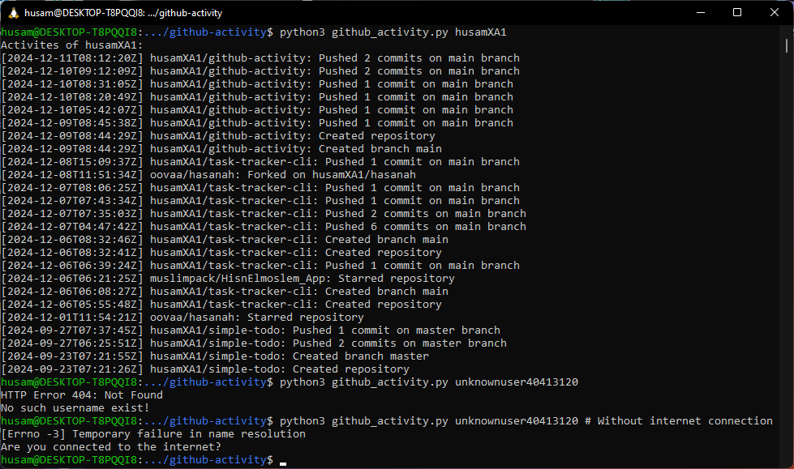

# github-activity

A simple CLI application to check the activity of GitHub users. It's a project from [roadmap.sh](https://roadmap.sh/projects/github-user-activity) projects.

## Quick Start

To run this application you should use Python interpreter and just pass it the username of a GitHub user to print his latest activities.

```bash
python github_activity.py <username>
```

### Usage Example



## Contribution

To contribute to this project and add any updates and ideas feel free to add an issue, fork and add a pull request, or contact me via email (husamxm0@gmail.com).

### Possible Updates

- The GitHub Activity API has many event types and not all of them are handled by the program.
- Extra error checking could be useful.
